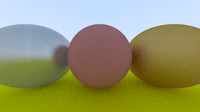

# Rust Raytracer

Rust implementation of [Raytracing in One Weekend](https://raytracing.github.io/books/RayTracingInOneWeekend.html) (WIP).
- [x] **Chapter 1**: Overview
- [x] **Chapter 2**: Output an Image
- [x] **Chapter 3**: The vec3 Class
- [x] **Chapter 4**: Rays, a Simple Camera, and a Background
- [x] **Chapter 5**: Adding a Sphere
- [x] **Chapter 6**: Surface Normals and Multiple Objects
- [x] **Chapter 7**: Antialiasing
- [x] **Chapter 8**: Diffuse Materials
- [x] **Chapter 9**: Metal
- [x] **Chapter 10**: Dielectrics
- [x] **Chapter 11**: Positionable Camera
- [x] **Chapter 12**: Defocus Blur

Usage: `cargo run > image.ppm`

You can open the image file with a program of your choice, i.e. preview.

Many thanks to [Fabio](https://github.com/codeFabio) for the help in the Raytracing related tasks and to [Ben](https://github.com/benbachem) for reviewing my Rust code!

Current state:

